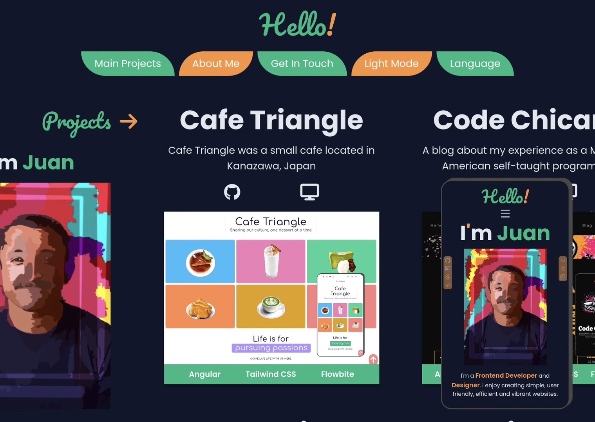
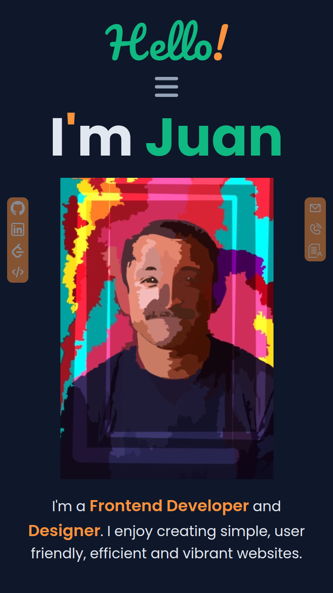

# My Portfolio

**Live Site:** [MyPortfolio](https://dev-jlagunas.github.io/my-portfolio/)

This is my jr developer portfolio site. It was created using Vue 3, Javascript, and styled with Tailwind CSS. The user interface is simple but vibrant. I paid special attention to
the user experience. I strived towards making the site easy to understand and navigate around while providing information in a efficient way. The site also has features such as dark/light modes, and is multi-lingual. Users may navigate in English, Spanish, and Japanese which are 3 languages I use. Furthermore, the site is responsive on all screen sizes.

## Features

- **Multi-lingual:** The portfolio site supports multiple languages, allowing users to switch between English, Spanish, and Japanese.
- **Responsive Design:** Designed to look and function well on all devices and across a wide range of screen sizes.
- **Beautiful User Interface:** I just really like the way the project ended up looking.
- **Built with Vue and Tailwind CSS:** I used Vue.js framework for dynamic and reactive components, and styled with Tailwind CSS for efficient and modular CSS design..
- **Modern Web Technologies:** Built with Vue, SCSS, and Tailwind CSS for a seamless and responsive user interface.
- **Modular Project Structure:** The project is highly modular, making it easy to maintain, update, and extend. Components are well-organized, promoting reusability and scalability.
- **Dark/Light Modes:** Intuitive navigation with a sidebar menu that allows users to easily switch between different planet pages.
- **Accessible:** The site follows best practices in web accessibility, ensuring that all users, including those with disabilities, can navigate and interact with the content.
- **Semantic HTML:** I made sure to use semantic HTML elements to provide better structure and meaning to the web content, improving SEO and accessibility..
- **Original Digital Art:** I created original self digital portraits of myself for which I am proud.

## Screenshots

### Desktop

  
  

## Recommended IDE Setup

[VSCode](https://code.visualstudio.com/) + [Volar](https://marketplace.visualstudio.com/items?itemName=Vue.volar) (and disable Vetur).

## Customize Configuration

See [Vite Configuration Reference](https://vitejs.dev/config/).

## Installation and Setup Instructions

Clone down this repository. You will need `node` and `npm` installed globally on your machine.

- **Install project dependencies:** `npm install`
- **To Start Server:** `npm run dev`
- **To Visit App:** `http://localhost:5173`

## Contributing

While this project is primarily a personal, educational project, input and suggestions are welcome. If you have feedback, please open an issue in this repository.

## License

This project is licensed under the terms of the MIT License. See the [LICENSE](LICENSE) file for details.

## Contact

**Juan Lagunas** - [GitHub](https://github.com/dev-jLagunas)

Email: dev.jlagunas@gmail.com

Feel free to reach out if you have any questions, or if you want to discuss this project. You can also [open an issue](https://github.com/dev-jLagunas/cosmic-neighborhood/issues/new) for any bugs you've found or enhancements you think would be useful.

For more of my work, check out my [GitHub profile](https://github.com/dev-jLagunas) or visit my Frontend Mentor profile for other projects I've done: [FrontendMentor](https://www.frontendmentor.io/profile/dev-jLagunas)

## Acknowledgements

- Thanks to [Vue](https://vuejs.org/)
- Thanks to [ZachHayes](https://zchry.org/) for the inspiration I got from his site.
- Thanks to all the contributors who have helped with this project.
- Thanks to anyone who takes the come to checkout my work.
- Thanks to my wife for giving me the opportunity to spend so much time in front of a computer.
